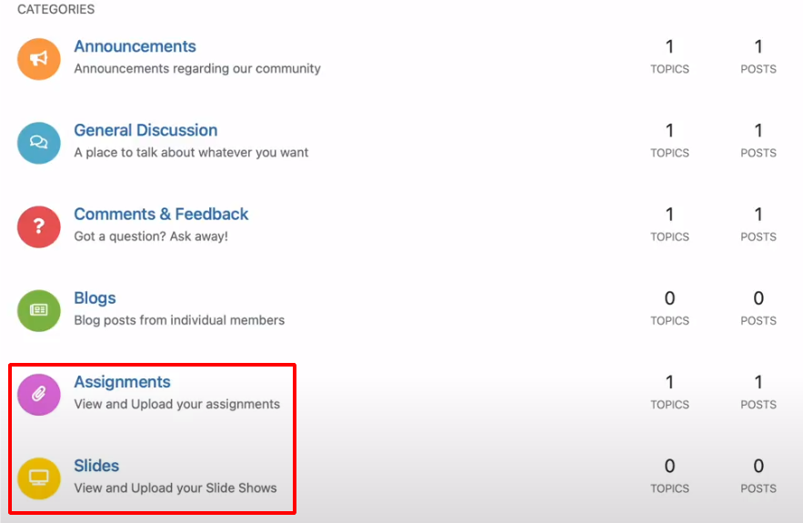
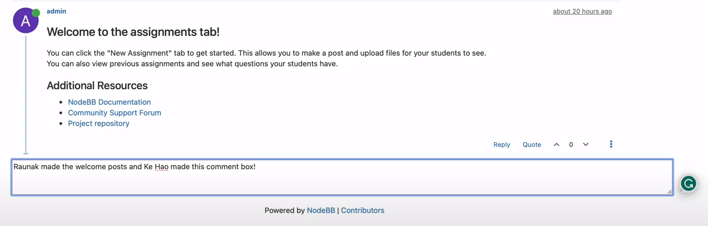

# KHROM User Guide for Added Features

## Features Added + User Testing

### Assignments Tab

Description: We added this tab as a way for Professors to upload assignments for their students to see. 

Usage/User testing: One way this implementation can be tested is to build NodeBB and first check if they can see the "Assignments" tab. If this works, then the user can click the tab and ensure that it opens up to the page where they can create a post with their assignment.

### Slides Tab

Description: We added this tab as a way for Professors to upload their lecture slides for their students to see. 

Usage/User testing: Similar to the "Slides" tab, this implementation can be tested is to build NodeBB and first check if they can see the "Slides" tab. If this works, then the user can click the tab and ensure that it opens up to the page where they can create a post with their slides.

The Assignments and Slides tab should appear as follows:

### New Welcome Posts

Description: Initially, only one welcome post existed for the ____ tab. We figured that this only gave additional information for one of the tabs, and the user could still be confused on how to use the other tabs. So we added welcome posts to each category to ensure that there was no confusion on how to use our created tabs.

Usage/User Testing: Users should click each category and ensure that they are able to see a detailed welcome post explaining how to use the respective tab.

### Comment Box + Submit Button

Description: For the slides tab, we wanted to add a comment section so that students could comment their questions on a Professor's lecture slides. While, we were able to create the comment box, we have yet been able to connect it to the backed in order to save the posted comments.

Usage/User testing: Users should be able to see the comment box on the slides tab at the bottom of the page. They should also be able to type their comments in the box and see a submit button, but not be able to submit it yet.

The welcome post and comment box should appear as follows:

### Create Assignment Button Visible to Only Admin

Description: Within the topic tools dropdown menu when you click into a category, we implemented a button called Create Assignment so admin (the Professor) can upload an assignment only students can make. The topic tools dropdown that has the create assignments button is only visible to admin (Professors), not students. We originally, wanted to change new topic button that is at the topic of each category page to only be shown on the admin page, however we could not figure out how to only show it on the admin page. So, as a workaround, we added the create assignment button to the topic tools since the permissions is already set to only admin.

Usage/User Testing: Only admin users should see the create assignments button. Admin users click into a category, click topic tools, and the first button shown from the dropdown should be create assignment.

## Testing

We added our tests to the following file: ./test/posts/uploads.js. We added our tests here because we mostly implemented front-end features which are often tested in this file. Our unit tests focus on ensuring whether our newly created categories have the correct category ID. We also focused a lot on visual and hands-on testing by user testing the front-end and checking for any unexpected behaviors.

